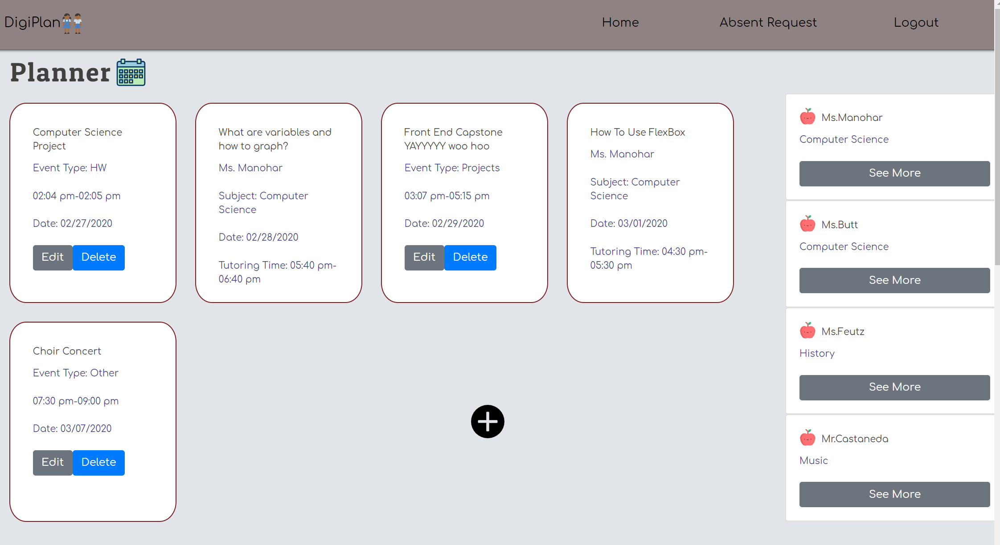

# DigiPlan

DigiPlan is a React web app with full CRUD functionality that allows for students to organize their upcoming events including homework assignments, tests, projects, sporting events, and work schedule. Students can additionally request a tutoring session from their teacher through the app which will then be approved or declined. If a student is absent for a day students can request the notes/classwork through a form. The teacher will then receive this request and then attach a PDF of the work done in class. The teacher can also send announcements via the message board which will then be displayed on the student's homepage.


# View a Demo of DigiPlan!

Video Demo
----------------------------------------

<a href="https://www.youtube.com/watch?v=JRmgrLiXNBE&feature=youtu.be"></a>

Click on video above or visit https://www.youtube.com/watch?v=JRmgrLiXNBE&feature=youtu.be to view the live demo.

 
 
 

## Installation

Install react packages:

```bash
npx create-react-app
npm i --save react-router-dom
npm install --save bootstrap
npm install --save reactstrap react react-dom
npm instal moment --save

npm start from the root directory to run application
```

## Database sample

Create a json file named database.json with the provided sample data and run a json server watching database.json on port 8088

```JSON
{
  "users": [],
  "userTypes": [
    {
      "id": 1,
      "name": "Student"
    },
    {
      "id": 2,
      "name": "Teacher"
    }
  ],
  "prefixes": [
    {
      "id": 1,
      "name": "Ms"
    },
    {
      "id": 2,
      "name": "Mrs"
    },
    {
      "id": 3,
      "name": "Mr"
    },
    {
      "id": 4,
      "name": ""
    }
  ],
  "subjects": [
    {
      "id": 1,
      "name": "Math"
    },
    {
      "id": 2,
      "name": "Science"
    },
    {
      "id": 3,
      "name": "History"
    },
    {
      "id": 4,
      "name": "English"
    },
    {
      "id": 5,
      "name": "Computer Science"
    },
    {
      "id": 6,
      "name": "Music"
    },
    {
      "id": 7,
      "name": "Physical Education"
    },
    {
      "id": 8,
      "name": ""
    }
  ],
  "events": [],
  "eventTypes": [
    {
      "id": 1,
      "name": "Game"
    },
    {
      "id": 2,
      "name": "HW"
    },
    {
      "id": 3,
      "name": "Tests"
    },
    {
      "id": 4,
      "name": "Projects"
    },
    {
      "id": 5,
      "name": "Work Shift"
    },
    {
      "id": 6,
      "name": "Other"
    }
  ],
  "tutoringRequests": [
  ],
  "absentRequests": [

  ],
  "messages": [

  ],
  "messageTypes": [
    {
      "id": 1,
      "name": "Summer Opportunity"
    },
    {
      "id": 2,
      "name": "Study Tip"
    },
    {
      "id": 3,
      "name": "Class Announcement"
    },
    {
      "id": 4,
      "name": "Extra Credit"
    }
  ]
}

```

## Cloudinary

1. Go to cloudinary.com and create an account
2. Create a new folder called TeacherUploads
3. On the dasboard, click more under account details, click on the down arrow next to the API Base URL and copy the image upload link
4. Change line 30 and 33 to match with your cloudinary account
5. Follow the directions on https://www.youtube.com/watch?v=hlYczGvLlDY&t=483s if more assistance is need

## Usage

1. Click on Register Teacher and add a few teachers. This will allow the student view to show the teachers.
2. Click on the Register Student Button
3. Add an event under the planner section by clicking on the plus button.
4. Edit and test delete the event as well.
5. Add a tutoring request.
6. Click on the the absent request tab and add an absent request.
7. Login into the teacher that you made a tutoring request and absent request for.
8. Accept the tutoring request.
9. Send a file when you open the choose file button on the absent request.
10. Log back into the student view. The tutoring request will be shown in the events section.
11. Click on the absent request and see the work sent from the teacher.
